# ConstitutionalERP System ERD (Grouped)

## 1. System and Domain Grouping (Color Key)

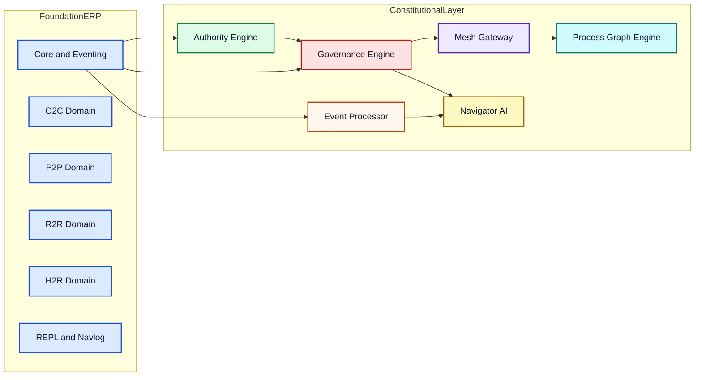

## 2. FoundationERP - Core and Eventing

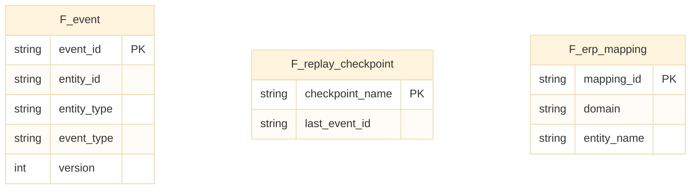

## 3. FoundationERP - O2C Domain

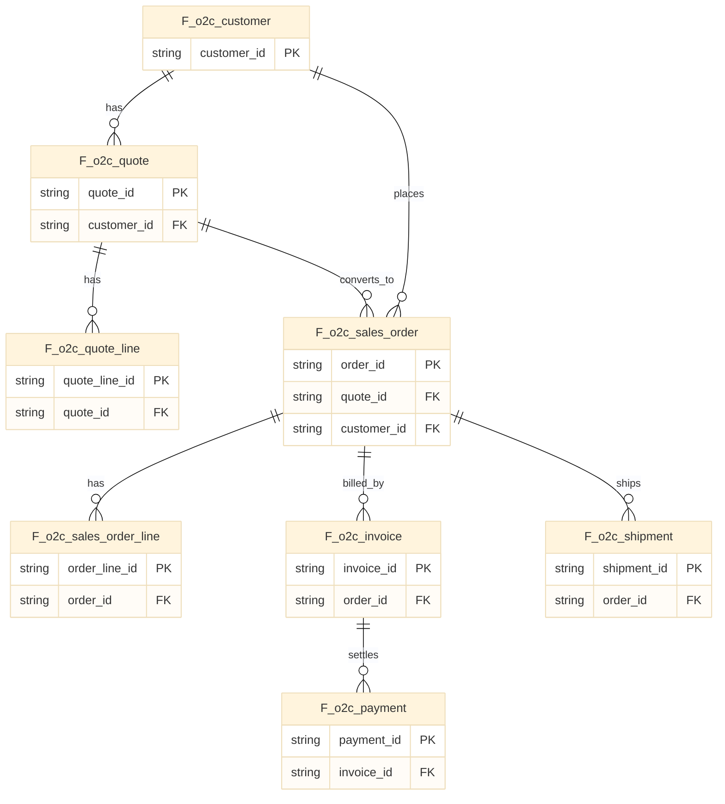

## 4. FoundationERP - P2P Domain

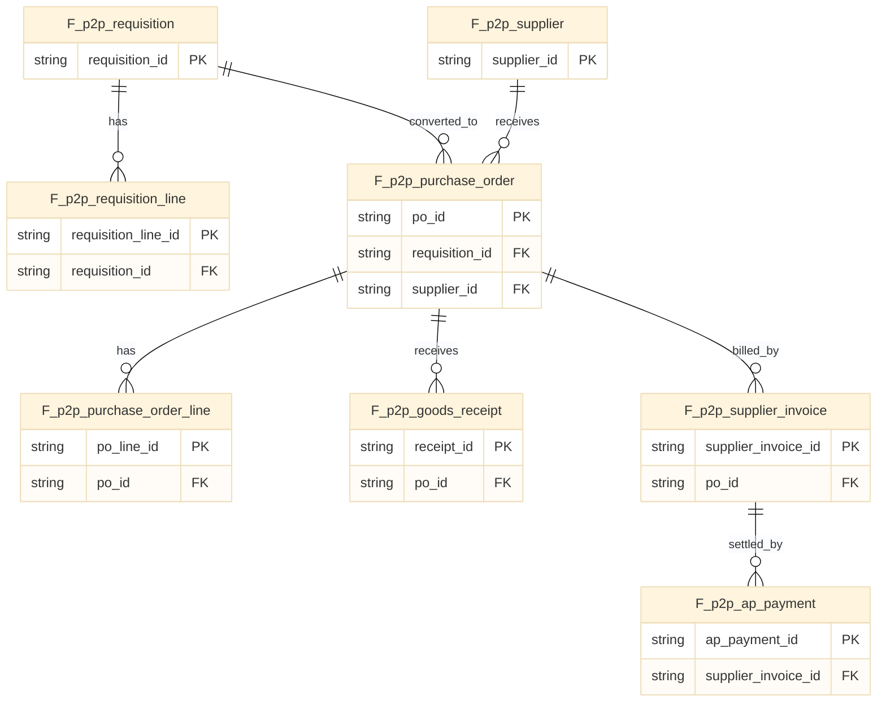

## 5. FoundationERP - R2R Domain

```mermaid
%%{init: {'theme':'base','themeVariables':{'fontFamily':'Segoe UI'},'themeCSS':'.er .entityLabel{font-size:44px !important;} .er .relationshipLabel{font-size:44px !important;} .er .attributeText{font-size:44px !important;} .er .entityBox{fill:#60a5fa !important;stroke:#1e40af !important;}'}}%%
erDiagram
    F_r2r_legal_entity {
        string legal_entity_id PK
        string parent_legal_entity_id FK
    }
    F_r2r_ledger {
        string ledger_id PK
        string legal_entity_id FK
    }
    F_r2r_ledger_set {
        string ledger_set_id PK
    }
    F_r2r_ledger_set_member {
        string ledger_set_id PK, FK
        string ledger_id PK, FK
    }
    F_r2r_account {
        string account_id PK
        string ledger_id FK
        string parent_account_id FK
    }
    F_r2r_fiscal_year {
        string fiscal_year_id PK
    }
    F_r2r_fiscal_period {
        string fiscal_period_id PK
        string fiscal_year_id FK
    }
    F_r2r_journal {
        string journal_id PK
        string fiscal_period_id FK
        string ledger_id FK
    }
    F_r2r_journal_line {
        string journal_line_id PK
        string journal_id FK
        string account_id FK
    }
    F_r2r_ledger_entry {
        string ledger_entry_id PK
        string journal_id FK
        string account_id FK
    }
    F_r2r_trial_balance_row {
        string trial_balance_row_id PK
        string fiscal_period_id FK
        string account_id FK
    }
    F_r2r_coa_segment_definition {
        string segment_definition_id PK
    }
    F_r2r_account_segment_value {
        string account_id PK, FK
        string segment_definition_id PK, FK
    }
    F_r2r_coa_combination_rule {
        string rule_id PK
    }
    F_r2r_coa_combination_rule_condition {
        string condition_id PK
        string rule_id FK
        string segment_definition_id FK
    }
    F_r2r_fx_rate_type {
        string rate_type_id PK
    }
    F_r2r_fx_rate {
        string rate_id PK
        string rate_type_id FK
    }
    F_r2r_sla_posting_profile {
        string posting_profile_id PK
    }
    F_r2r_sla_posting_profile_line {
        string posting_profile_line_id PK
        string posting_profile_id FK
        string account_id FK
    }

    F_r2r_legal_entity ||--o{ F_r2r_legal_entity : parent_of
    F_r2r_legal_entity ||--o{ F_r2r_ledger : owns
    F_r2r_ledger ||--o{ F_r2r_ledger_set_member : member_of
    F_r2r_ledger_set ||--o{ F_r2r_ledger_set_member : contains
    F_r2r_ledger ||--o{ F_r2r_account : contains
    F_r2r_account ||--o{ F_r2r_account : parent_of
    F_r2r_fiscal_year ||--o{ F_r2r_fiscal_period : contains
    F_r2r_fiscal_period ||--o{ F_r2r_journal : contains
    F_r2r_ledger ||--o{ F_r2r_journal : posts_to
    F_r2r_journal ||--o{ F_r2r_journal_line : has
    F_r2r_account ||--o{ F_r2r_journal_line : referenced_by
    F_r2r_journal ||--o{ F_r2r_ledger_entry : posts
    F_r2r_account ||--o{ F_r2r_ledger_entry : referenced_by
    F_r2r_fiscal_period ||--o{ F_r2r_trial_balance_row : summarized_into
    F_r2r_account ||--o{ F_r2r_trial_balance_row : summarized_into
    F_r2r_account ||--o{ F_r2r_account_segment_value : segmented_by
    F_r2r_coa_segment_definition ||--o{ F_r2r_account_segment_value : defines
    F_r2r_coa_combination_rule ||--o{ F_r2r_coa_combination_rule_condition : has
    F_r2r_coa_segment_definition ||--o{ F_r2r_coa_combination_rule_condition : constrains
    F_r2r_fx_rate_type ||--o{ F_r2r_fx_rate : rates
    F_r2r_sla_posting_profile ||--o{ F_r2r_sla_posting_profile_line : has
    F_r2r_account ||--o{ F_r2r_sla_posting_profile_line : maps_to
```

## 6. FoundationERP - H2R and REPL/Navlog

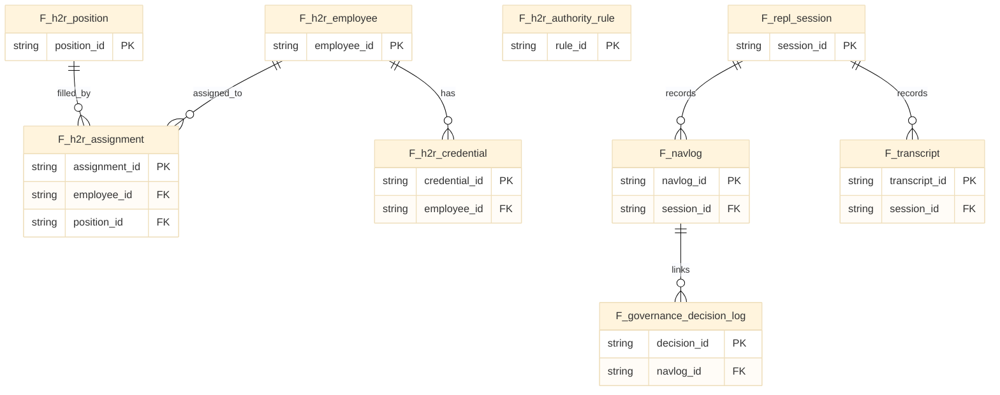

## 7. Authority Engine

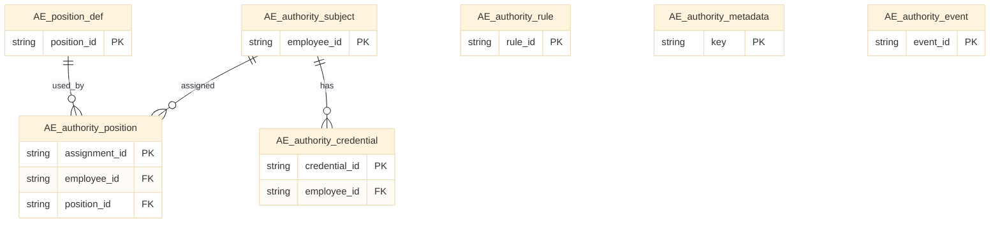

## 8. Governance Engine

```mermaid
%%{init: {'theme':'base','themeVariables':{'fontFamily':'Segoe UI'},'themeCSS':'.er .entityLabel{font-size:44px !important;} .er .relationshipLabel{font-size:44px !important;} .er .attributeText{font-size:44px !important;} .er .entityBox{fill:#fee2e2 !important;stroke:#991b1b !important;}'}}%%
erDiagram
    GE_governance_rule {
        string rule_id PK
    }
    GE_governance_projection_metadata {
        string key PK
    }
    GE_governance_actor_credential {
        string credential_id PK
    }
    GE_governance_action_history {
        int history_id PK
    }
    GE_governance_decision_log {
        string decision_id PK
    }
    GE_governance_event {
        string event_id PK
    }
```

## 9. Event Processor

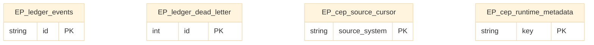

## 10. Mesh Gateway

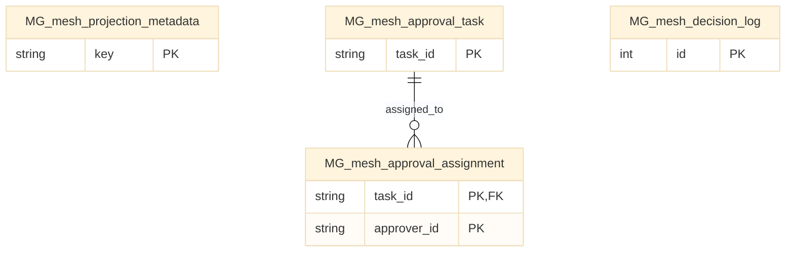

## 11. Navigator AI

```mermaid
%%{init: {'theme':'base','themeVariables':{'fontFamily':'Segoe UI'},'themeCSS':'.er .entityLabel{font-size:44px !important;} .er .relationshipLabel{font-size:44px !important;} .er .attributeText{font-size:44px !important;} .er .entityBox{fill:#fef9c3 !important;stroke:#a16207 !important;}'}}%%
erDiagram
    NAI_navigator_llm_log {
        string id PK
    }
    NAI_navigator_ranking_decision {
        string id PK
    }
    NAI_navigator_simulation_run {
        string id PK
    }
    NAI_navigator_governance_outcome {
        string id PK
    }
    NAI_navigator_execution_trace {
        string id PK
    }
    NAI_navigator_repl_transcript {
        int id PK
    }
    NAI_navigator_cache {
        string cache_key PK
    }
    NAI_navigator_replay_metadata {
        string key PK
    }
    NAI_navigator_event_log {
        string id PK
    }
```

## 12. Process Graph Engine

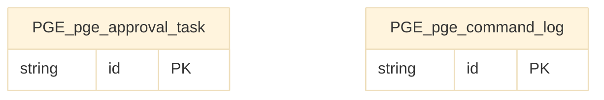

## 13. Cross-System Logical Links

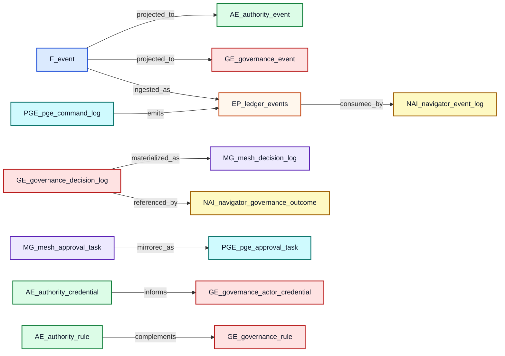

Integration Hub is intentionally stateless in this codebase (no local migration set), so it is represented by cross-system logical links rather than owned tables.
