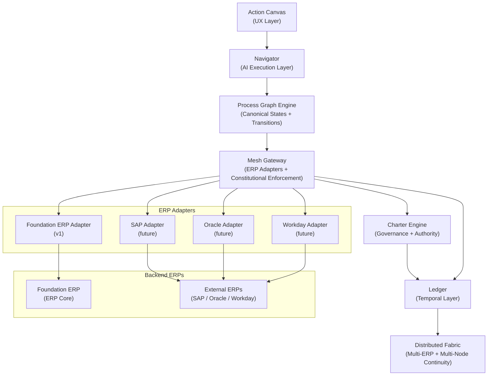
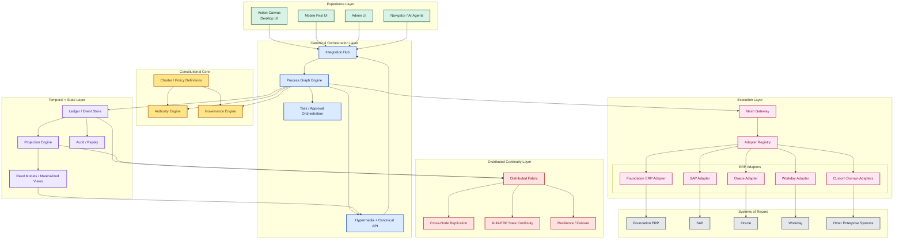

#Constitutional ERP 

Constitutional ERPis an AI executed, human governed enterprise system built on an immutable constitutional fabric that guarantees process integrity, authority control, and reconstructable operations across a distributed mesh.

## Category Description

### Constitutional ERP

Constitutional ERP is an emerging class of enterprise platforms that combine AI driven operational execution with governance anchored control frameworks to deliver resilient, autonomous, and reconstructable business systems. Unlike traditional ERP suites, which rely on role based workflows and monolithic data models, Constitutional ERPs operate on a distributed constitutional fabric that enforces non bypassable rules, process integrity, and earned authority across all business domains.
Constitutional ERPs use AI as the primary execution engine, interpreting process state, proposing next actions, and automating routine operations. Human users act as governors rather than operators, providing oversight, approvals, and corrective interventions. A constitutional layer — composed of immutable rules, domain constraints, and authority models — ensures that neither AI nor human actors can violate enterprise policy, regulatory requirements, or process integrity.
At the architectural level, Constitutional ERPs are defined by event sourced temporal ledgers, distributed mesh fabrics, and hypermedia driven process graphs. These systems maintain a complete, immutable record of all operational events, enabling full rollback, replay, and system reconstruction across heterogeneous ERP backends. This allows organizations to operate with unprecedented resilience, auditability, and vendor independence.
Gartner expects Constitutional ERP platforms to be adopted first in industries with high regulatory exposure, complex multi entity operations, or strong requirements for auditability and operational continuity. Over time, the category is likely to expand into mainstream enterprise operations as organizations seek to modernize legacy ERP estates, reduce operational overhead, and adopt AI driven execution models without sacrificing governance or control.

### Key Characteristics of Constitutional ERP
•	AI Driven Execution:
AI navigates processes, proposes and executes actions, and provides explainability.
•	Human Anchored Governance:
Users act as approvers and governors, with authority determined by earned credentials and risk tiers.
•	Constitutional Control Layer:
Immutable rules and domain constraints enforce compliance and prevent unauthorized actions.
•	Event Sourced Temporal Integrity:
All operations are recorded as immutable events, enabling rollback, replay, and full system reconstruction.
•	Mesh Native Architecture:
Distributed fabric ensures resilience, continuity, and multi ERP interoperability.
•	Process First UX:
Interfaces expose state driven affordances rather than role based menus or modules.
### Market Drivers
•	Rising demand for AI enabled operational automation
•	Increasing regulatory pressure for auditability and traceability
•	Need for resilient, reconstructable enterprise systems
•	Desire to reduce dependency on monolithic ERP vendors
•	Shift toward distributed, multi entity operating models
### Category Definition: Constitutional ERP
Constitutional ERP is a new category of enterprise system in which AI executes operations, humans govern decisions, and a constitutional fabric enforces the rules that neither can bypass.
It replaces role based interfaces and monolithic back office systems with a process first, state driven architecture built on immutable events, distributed mesh resilience, and earned authority.

A Constitutional ERP is defined by five core principles:

1. AI Driven Execution
The system’s primary operator is an AI Navigator that interprets process state, proposes next actions, executes transitions, and explains its reasoning. Humans intervene only where governance requires it.
2. Human Anchored Governance
Authority is earned, contextual, and revocable. Humans approve, correct, and oversee — but do not manually drive every step. Governance is structural, not procedural.
3. Constitutional Constraints
A Charter Engine enforces immutable rules, domain boundaries, and non bypassable limits. Neither AI nor humans can violate the constitution of the enterprise.
4. Temporal Integrity
All operations are recorded as events in a Ledger that supports versioning, rollback, and replay. Any system state — including external ERPs — can be reconstructed from the constitutional record.
5. Mesh Native Architecture
A distributed Mesh Fabric ensures resilience, continuity, and multi system orchestration. ERPs become projections on the mesh, not the source of truth.

### Context

AI driven UX, process first, domain governed, event sourced, mesh backed, ERP agnostic.

1. AI Drives Execution
•	Proposes actions at every step
•	Navigates the process graph
•	Explains decisions
•	Simulates outcomes
2. Humans Govern
•	Approve actions
•	Provide authority
•	Correct errors
•	Trigger rollback/replay
3. Mesh Is the Constitutional Truth
•	Records every event
•	Enforces governance
•	Supports rollback + replay
•	Reconstructs ERP state
4. ERP Is a Projection
•	Executes commands
•	Posts transactions
•	Can be replaced or rebuilt
5. UX Is Process First
•	No roles
•	No menus
•	No modules
•	Only “what is possible next”

Mermaids

